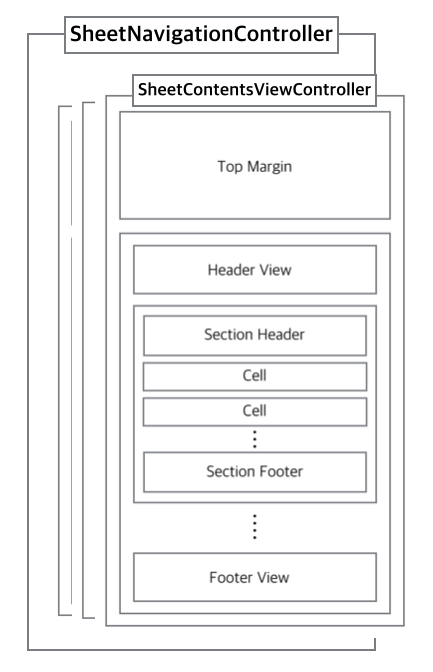
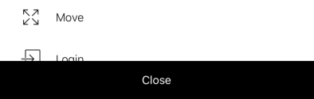

<p align="center">
   
</p>

<p align="center">
   <a href="https://developer.apple.com/swift/">
      
   </a>
      <a href="https://developer.apple.com/">
      
   </a>
   <a href="http://cocoapods.org/pods/Sheet">
      
   </a>
   <a href="https://github.com/Carthage/Carthage">
      
   </a>
      <a href="http://cocoapods.org/pods/Sheet">
      
   </a>
      <a href="https://github.com/ParkGwangBeom/Sheet/blob/master/LICENSE?raw=true">
      
   </a>
</p>

<br/>

<p align="center">
📑 SHEET helps you easily create a wide variety of action sheets with navigation features used in the Flipboard App
</p>

<br/>

<p align="center">
   
</p>

## Installation

### CocoaPods
```bash
pod 'Sheet', '~> 0.6.0'
```

### Carthage
```bash
github "ParkGwangBeom/Sheet" ~> 0.6.0
```

### Manually

If you prefer not to use either of the aforementioned dependency managers, you can integrate Sheet into your project manually.

## Usage

Implementing the contents of a Sheet is similar to implementing an existing UICollectionViewController.
Simply make your view controller subclass of SheetContentsViewController.

```
import Sheet

class ViewController: SheetContentsViewController {

   /// Sheet visible contents height. If contentSize height is less than visibleContentsHeight, contentSize height is applied.
    override var visibleContentsHeight: CGFloat {
        return 600
    }
    
    /// Give CollectionView a chance to regulate Supplementray Element
    override func registCollectionElement() {
        let nib = UINib(nibName: "TitleHeaderView", bundle: nil)
        collectionView?.register(nib, forSupplementaryViewOfKind: SheetLayoutElement.header.kind, withReuseIdentifier: SheetLayoutElement.header.id)
    }

    /// Provide an opportunity to set default settings for collectionview custom layout
    override func setupSheetLayout(_ layout: SheetContentsLayout) {
        layout.settings.itemSize = { indexPath in
            let height: CGFloat = indexPath.section == 0 ? 30 : 60
            return CGSize(width: UIScreen.main.bounds.width, height: height)
        }
        layout.sectionInset = UIEdgeInsets(top: 0, left: 0, bottom: 15, right: 0)
        layout.settings.headerSize = CGSize(width: UIScreen.main.bounds.width, height: 60)
        layout.settings.isHeaderStretchy = true
    }
    
   override func collectionView(_ collectionView: UICollectionView, numberOfItemsInSection section: Int) -> Int {
        return 10
    }
    
    override func collectionView(_ collectionView: UICollectionView, cellForItemAt indexPath: IndexPath) -> UICollectionViewCell {
        let cell = collectionView.dequeueReusableCell(withReuseIdentifier: "cell", for: indexPath)
         ...
        return cell
    }
    
    override func collectionView(_ collectionView: UICollectionView, didSelectItemAt indexPath: IndexPath) {
         ...
    }
   
     ...
}
```

You can use the custom action sheet transition using the default api provided by UIKit such as present, push, pop.
> 🔥 **However, do not use the dismiss of the NavigationController, but use the close (duration: completion :) function.**
```
// present
let contentsViewController = ViewController()
let sheetNavigation = SheetNavigationController(rootViewController: contentsViewController)
present(sheetNavigation, animated: true, completion: nil)

// push
let nextContentsViewController = NextContentsViewController()
navigationController?.pushViewController(nextContentsViewController, animated: true)

// pop
navigationController?.popViewController(animated: true)
```
**See the Example project for more details.**


## Layout
**Sheet** basically has Navigation structure. All children should inherit from **SheetContentsViewController**. SheetContentsViewController inherits **UICollectionViewController** by default, and its layout is like the following image. 

<p align="center">
   
</p>

**Please refer to Example Code for detailed setting of image layout.**


## Advanced
Easily customizable by SheetContents.

### Options

| Property | Type | Default Value |
| -------- | ---  |  ---  |
| `defaultToolBarBackgroundColor` | `UIColor` | `.black` |
| `sheetToolBarHeight` | `CGFloat`| `50`|
| `isSheetToolBarHidden` | `Bool` | `false`|
| `cornerRadius` | `CGFloat` | `0`|
| `defaultVisibleContentHeight` | `CGFloat` | `240`|
| `dimmingViewBackgroundColor` | `UIColor` | `.black.withAlphaComponent(0.3)`|
| `sheetBackgroundColor` | `UIColor` | `.white`|
| `presentTransitionType` | `SheetPresentTransitionType` | `.scale`|

### Layout Settings

| Property | Type |
| -------- | ---  |
| `headerSize` | `CGSize?` |
| `footerSize` | `CGSize?`|
| `itemSize` | `((IndexPath) -> CGSize)?` |
| `sectionHeaderSize` | `((IndexPath) -> CGSize)?` |
| `sectionFooterSize` | `((IndexPath) -> CGSize)?` |

### SheetContentsViewController

| Property | Type |
| -------- | ---  |
| `sheetToolBar` | `UIView` |

| Method | Explanation |
| -------- | ---  |
| `func registCollectionElement()` | `Give CollectionView a chance to regulate Supplementray Element` |
| `func setupSheetLayout()` | `Provide an opportunity to set default settings for collectionview custom layout`|
| `func reload()` | `Help reload CollectionView and adjust the height of the content.`|
| `func close(completion: (() -> Void)? = nil)` | `Sheet Dismiss`|

### Custom ToolBar

The built-in toolbar consists of a single button.

| Default ToolBar |
|------- | 
| |

Setting up a Custom ToolBar is very simple.
```
sheetToolBar = CustomToolBar()
```

## Author

- GwangBeom Park ([@gwangbeom](https://github.com/ParkGwangBeom))

## License

Sheet is released under the MIT license. See LICENSE for details.

